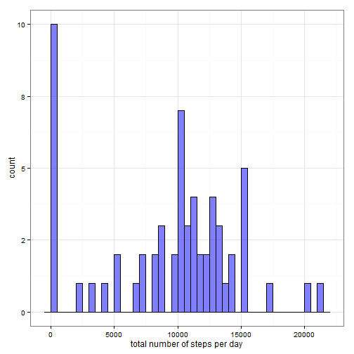
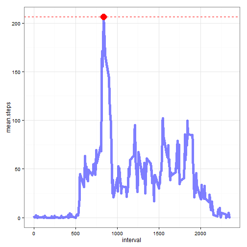
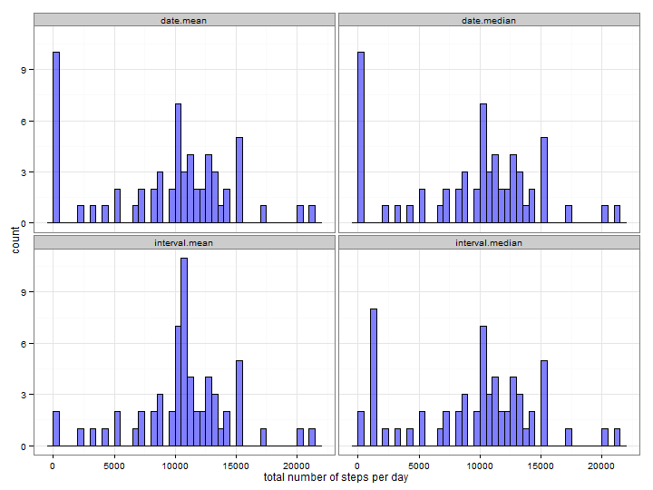
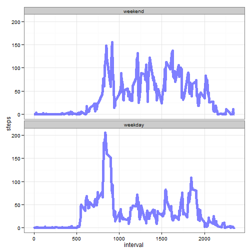

## Reproducible Research: Peer Assessment 1

5/18/2014

**Note**: This RMD was created using the Preview Release of RStudio (0.98.847) and may contain features incompatible with earlier versions of RStudio.

**Note2**: Some calculations (mean, median etc) were completed using inline r script, which was not render in the final html.


### Loading and preprocessing the data
#### Instruction
- Load the data (i.e. read.csv())
- Process/transform the data (if necessary) into a format suitable for your analysis

#### Solution
Data was imported from *activity.csv* and stored in a data frame *activity*.

```r
library(ggplot2)
library(lubridate)

options(digits = 0, scipen = 10)

activity <- read.csv("activity.csv", stringsAsFactors = FALSE)
activity$date <- ymd(activity$date)
str(activity)
```

```
## 'data.frame':	17568 obs. of  3 variables:
##  $ steps   : int  NA NA NA NA NA NA NA NA NA NA ...
##  $ date    : POSIXct, format: "2012-10-01" "2012-10-01" ...
##  $ interval: int  0 5 10 15 20 25 30 35 40 45 ...
```


### What is mean total number of steps taken per day?
#### Instruction
- Make a histogram of the total number of steps taken each day
- Calculate and report the mean and median total number of steps taken per day

#### Solution
Function *aggregate()* was used to compute daily total steps. The data was then visualized in *ggplot2*.

```r
# histogram of the total steps per day
daily.sum <- aggregate(steps ~ date, data = activity, sum, na.rm = TRUE, na.action = na.pass)
colnames(daily.sum) <- c("date", "total.steps")
ggplot(daily.sum, aes(x = total.steps)) + geom_bar(stat = "bin", binwidth = 500, 
    colour = "black", fill = "blue", alpha = 0.5) + xlab("total number of steps per day") + 
    theme_bw()
```

 


The **mean** is 9354. The **median** is 10395.


### What is the average daily activity pattern?
#### Instruction
- Make a time series plot (i.e. type = "l") of the 5-minute interval (x-axis) and the average number of steps taken, averaged across all days (y-axis)
- Which 5-minute interval, on average across all the days in the dataset, contains the maximum number of steps?

#### Solution
Function *aggregate()* was again used to compute average steps for each interval. From there a time series plot was created and maximum step interval calculated. 

```r
time.series <- aggregate(steps ~ interval, data = activity, mean, na.rm = TRUE, 
    na.action = na.pass)
colnames(time.series) <- c("interval", "mean.steps")

# Calcuate the maximum number of steps
x.max <- time.series$interval[which.max(time.series$mean.steps)]
y.max <- max(time.series$mean.steps)

# Line plot for daily activity pattern
ggplot(time.series, aes(x = interval, y = mean.steps)) + geom_line(color = "blue", 
    alpha = 0.5, size = 2) + geom_hline(aes(yintercept = max(time.series$mean.steps)), 
    colour = "red", linetype = "dashed") + geom_point(aes(x = x.max, y = y.max), 
    color = "red", size = 6) + theme_bw()
```

 


The time interval with maximum number of steps is 835 which contains 206 steps.


### Imputing missing values
#### Instruction
Note that there are a number of days/intervals where there are missing values (coded as NA). The presence of missing days may introduce bias into some calculations or summaries of the data.

- Calculate and report the total number of missing values in the dataset (i.e. the total number of rows with NAs)
- Impute the missing values using the mean/median for that day, or the mean for that 5-minute interval.
- Create a new dataset that is equal to the original dataset but with the missing data filled in.
- Make a histogram of the total number of steps taken each day and Calculate and report the mean and median total number of steps taken per day. 
- What is the impact of imputing missing data on the estimates of the total daily number of steps?

#### Solution
- The total missing value in the dataset is 2304.
- Per instruction, there exist at least four approaches to impute the missing values: mean/median for the day and mean/median for the same 5 minute interval everyday. It was decided to implement all four methods and compare their performance.


```r
library(reshape2)
activity.cast <- dcast(activity, interval ~ date, value.var = "steps")
rownames(activity.cast) <- activity.cast$interval
activity.cast$interval <- NULL

# Helper function to replace NA with mean or median
ReplaceNA <- function(x, method = "mean") {
    x[is.na(x)] <- do.call(method, list(x, na.rm = TRUE))
    return(x)
}

# Replace the mssing values using the mean/median for that day
date.mean <- apply(activity.cast, 2, ReplaceNA)
date.median <- apply(activity.cast, 2, ReplaceNA, method = "median")

# Replace the mssing values using the mean/median for that 5-minute interval
interval.mean <- t(apply(activity.cast, 1, ReplaceNA))
interval.median <- t(apply(activity.cast, 1, ReplaceNA, method = "median"))
```


After four dataframes with imputed values were created, they were combined into a single dataframe to facilitate side-by-side visualization using *ggplot2*.

```r
# Compute total step and combine into one df for ploting & comparison
combined <- data.frame(date.mean = colSums(date.mean, na.rm = TRUE), date.median = colSums(date.median, 
    na.rm = TRUE), interval.mean = colSums(interval.mean, na.rm = TRUE), interval.median = colSums(interval.median, 
    na.rm = TRUE))
combined$date <- rownames(combined)
combined.melt <- melt(combined, id = "date")

# hist(colSums(date.mean, na.rm=TRUE), breaks=40)

ggplot(combined.melt, aes(x = value)) + geom_bar(stat = "bin", binwidth = 500, 
    colour = "black", fill = "blue", alpha = 0.5) + facet_wrap(~variable, ncol = 2) + 
    xlab("total number of steps per day") + theme_bw()
```

 


It is obvious from the plot that different imputation method led to different results. The curves with data computed from daily mean/median are identical to the original un-imputed one, whereas imputation with mean/median from same intervals produced different-looking curves. 

The mean and median total number of steps per day derived from different imputation methods are summarized in the following table.

Imputation      | Mean                                           | Median
--------------- | ---------------------------------------------- | ------------------------------------------------
No (control)    | 9354                | 10395
Day mean        | 9354       | 10395
Day median      | 9354     | 10395
Interval mean   | 10766   | 10766
Interval median | 9504 | 10395

In summary, imputations with mean or median of the same day are ineffective for this data set. The reason becomes obvious after visual examination of the data which revealed that often the steps data are missing for entire days making imputation for those days impossible.

Imputation based on the same interval (time of the day), intuitively, makes more sense because the individual is likely to be engaged in similar activities every day (assuming s/he has a regular schedule). Whereas the level of activity at different time of the day may be less indicative.

There is a rather significant difference between the results based on interval mean and interval median. The curve based on interval mean also differs significantly from the original curve, which indicates it may be an artifact and can not be supported by the data. Possibly, the data is left- or right-skewed and hence its mean deviates from the median.


### Are there differences in activity patterns between weekdays and weekends?
#### Instruction
- For this part the weekdays() function may be of some help here. Use the dataset with the filled-in missing values for this part.
- Create a new factor variable in the dataset with two levels -- "weekday" and "weekend" indicating whether a given date is a weekday or weekend day.
- Make a panel plot containing a time series plot (i.e. type = "l") of the 5-minute interval (x-axis) and the average number of steps taken, averaged across all weekday days or weekend days (y-axis). The plot should look something like the following, which was creating using simulated data:

#### Solution
Based on the above discussion, imputation method based on interval median was adopted and used for the following analysis. The imputed data was split into *weekday* and *weekend* to compute their statistics separately, and then combined again for visualization in *ggplot2*.


```r
interval.median <- as.data.frame(interval.median)
interval.median$interval <- rownames(activity.cast)
imputed.activity <- melt(interval.median, id = "interval")
colnames(imputed.activity) <- c("interval", "date", "steps")
imputed.activity$date <- ymd(imputed.activity$date)

weekend <- subset(imputed.activity, weekdays(date) %in% c("Saturday", "Sunday"))
weekday <- subset(imputed.activity, !(weekdays(date) %in% c("Saturday", "Sunday")))

weekend.ts <- aggregate(steps ~ interval, data = weekend, mean, na.rm = TRUE, 
    na.action = na.pass)
weekday.ts <- aggregate(steps ~ interval, data = weekday, mean, na.rm = TRUE, 
    na.action = na.pass)

time.series2 <- rbind(data.frame(weekend.ts, week = "weekend"), data.frame(weekday.ts, 
    week = "weekday"))
time.series2$interval <- as.numeric(time.series2$interval)

ggplot(time.series2, aes(x = interval, y = steps)) + geom_line(color = "blue", 
    alpha = 0.5, size = 2) + facet_wrap(~week, ncol = 1) + theme_bw()
```

 


In summary, there are several significant differences between the weekday and weekend profiles. 

- The weekend curve has a delayed onset perhaps related to late wake up time. 
- There is generally a higher degree of activities during the weekend than weekday.
- There are also more activities towards the end of the day in weekend.

